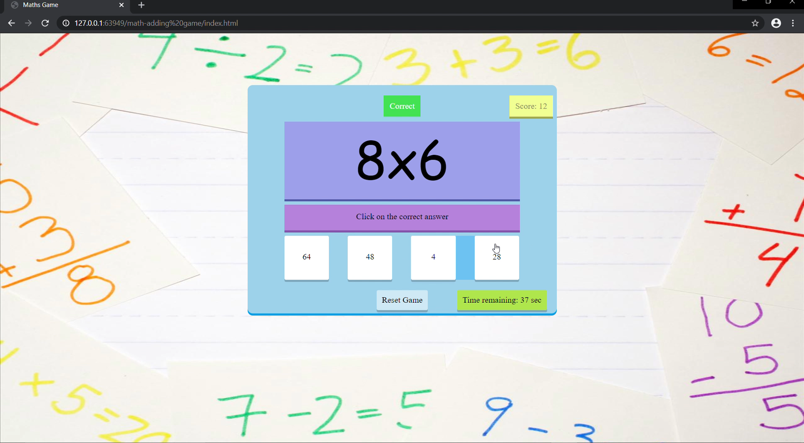

# Online-Math-Game
A math game that gives out random question of multiplication and 4 random answers. \
The player will be given 1 minute to solve as many questions as possible.\ 
The game is programmed using HTML, CSS and Javascript.\

Here is a video of the presentation of this app:
[Screen recording of demonstrating how to play this math game](https://youtu.be/hihvIArTfVc)

Here is a screen shot of the app:\

